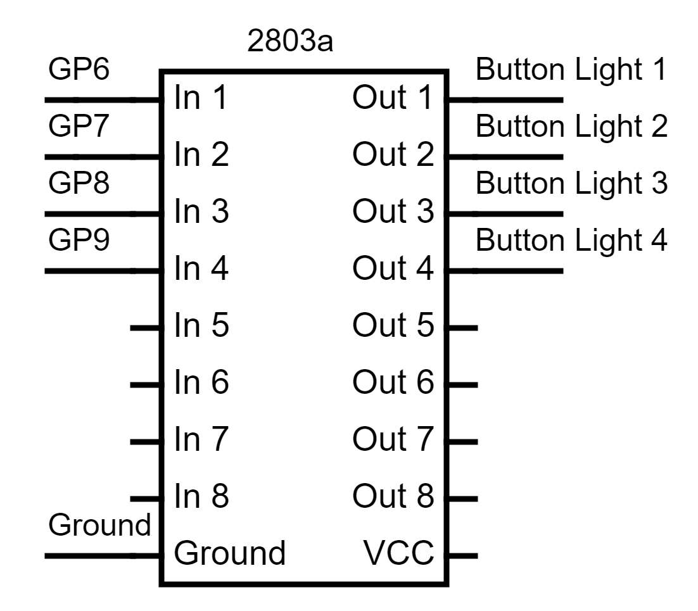
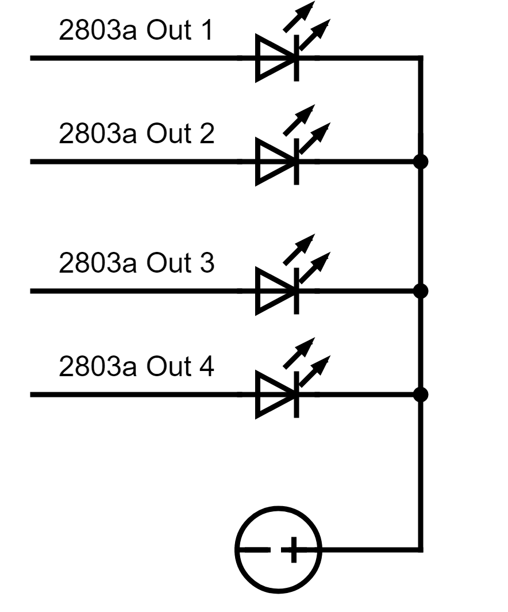
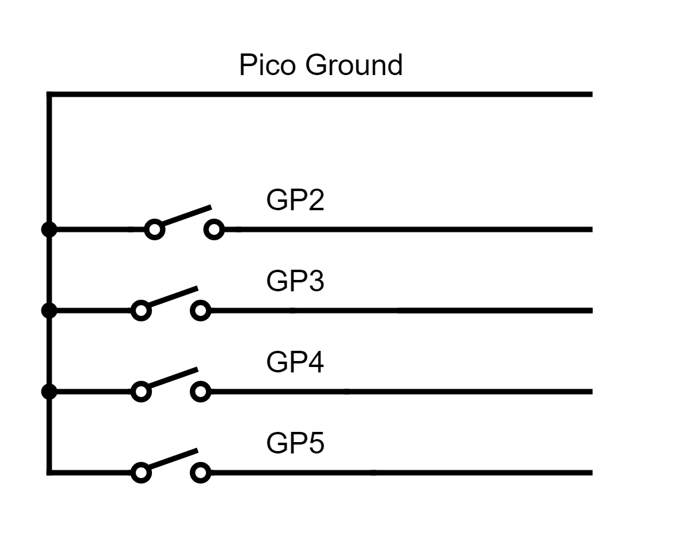
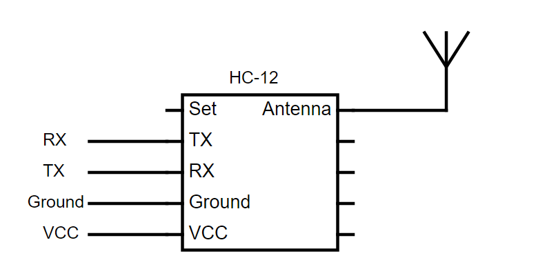
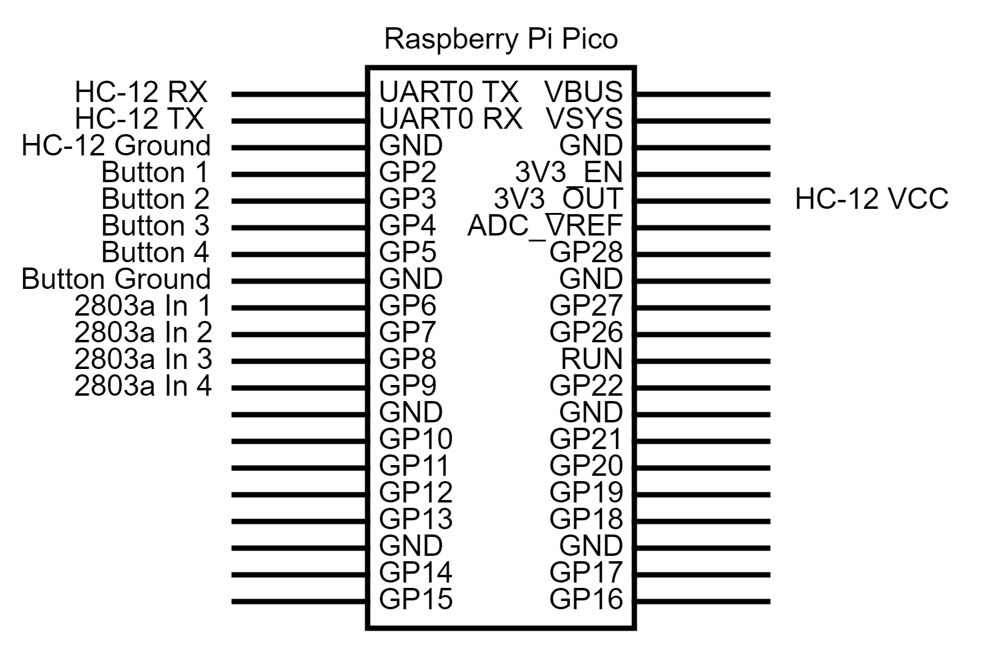
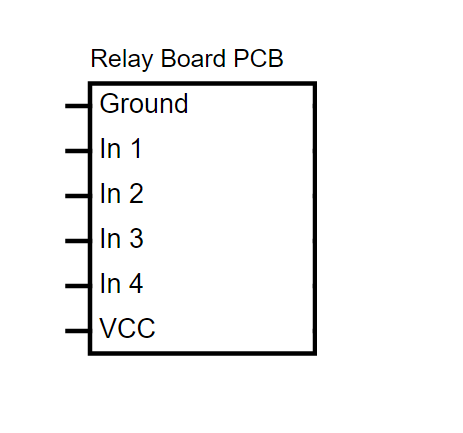
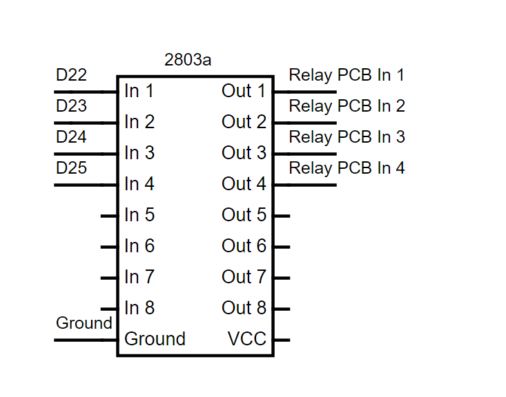
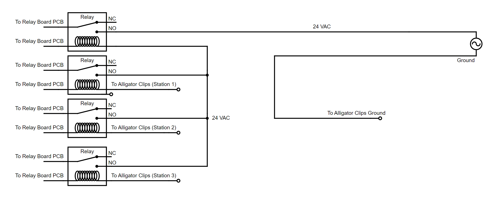
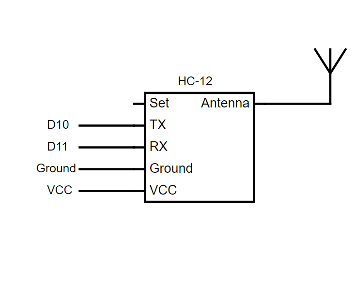
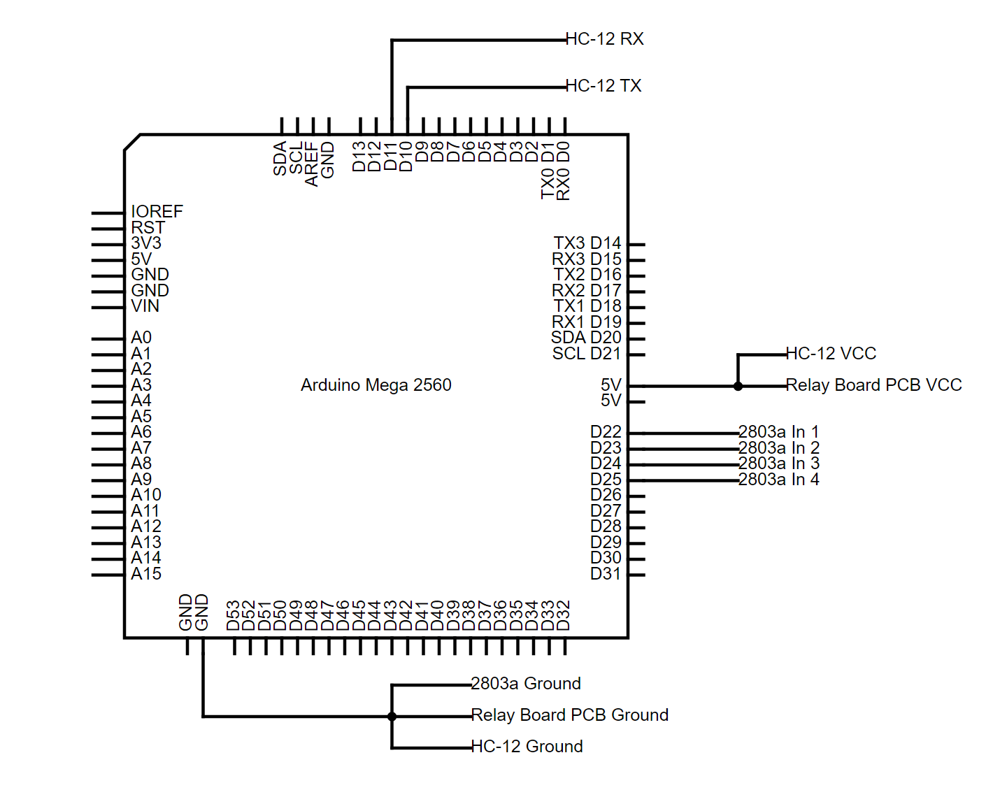

# Raspberry Pi Sprinkler Remote
### What? 
A remote controller used by industry professionals to control sprinkler systems when performing on-site inspections or repairs. There are two separate devices to use. First, the main control box is connected to the existing sprinkler remote box or valve wires. Next, the remote controller is powered and used to send a signal to the main control box. Although not as robust, this is sufficient for most needs. 

### Why?
Many of the existing solutions are expensive, locked to a system and quite buggy. This is an open source project allowing anyone to create their own remote and use it on site. 

## The Project 
---
### **Items**

#### Remote 

1. <a href="https://www.raspberrypi.com/products/raspberry-pi-pico/" target="_blank">Raspberry Pico!</a> or any micro controller with access to serial/UART
2. <a href="https://www.digikey.com/en/products/detail/bud-industries/CU-389-MB/439256" target="_blank">Encloure</a> or similar item
3. <a href="https://www.amazon.com/gp/product/B083QMF2J1" target="_blank">Latching Light Up Buttons</a>  or any buttons 
4. <a href="https://www.newark.com/stmicroelectronics/uln2803a/darlington-transistor-array-npn/dp/89K1143" target="_blank">ULN2803A DARLINGTON TRANSISTOR ARRAY, NPN, 8, 50V, DIP</a>  or similar Darlington array(a smaller array will work)
5. <a href="https://www.amazon.com/dp/B01MYTE1XR" target="_blank">HC-12 433Mhz</a> or similar HC-12 433Mhz module.

### Control Box 
1. <a href="https://store-usa.arduino.cc/products/arduino-mega-2560-rev3?selectedStore=us" target="_blank">Arduino Mega 2560</a> or any micro controller with access to serial/uart. Even a pico can work here. 
2. <a href="https://www.amazon.com/dp/B01MYTE1XR" target="_blank"> HC-12 433Mhz</a> or similar HC-12 433Mhz module.
3. <a href="https://www.digikey.com/en/products/detail/bud-industries/AN-1307-A/5804544" target="_blank"> Enclosure</a>  or similar item
4. Harness/Valve Connectors: <a href="https://www.digikey.com/en/products/detail/phoenix-contact/1771282/3605936" target="_blank"> M-Socket</a> and <a href="https://www.digikey.com/en/products/detail/phoenix-contact/1789203/5189404" target="_blank"> F-Header</a> 
5. Power Connectors: <a href="https://www.digikey.com/en/products/detail/phoenix-contact/1714977/2527925" target="_blank"> M-Socket</a> and <a href="https://www.digikey.com/en/products/detail/phoenix-contact/1727566/3596865" target="_blank"> F-Header</a> 

6. <a href="https://www.amazon.com/dp/B07KQH5GXL?psc=1&ref=ppx_yo2ov_dt_b_product_details" target="_blank"> Power Cord</a> or similar 24v AC power adapter. The same cord from sprinkler controllers can be used here
7. <a href="https://www.amazon.com/dp/B0057OC5O8" target="_blank"> 4 Channel Relay Board</a>  or similar. A larger relay board may be used to control more stations
8.  <a href="https://www.newark.com/tenma/76-1646/banana-plug-4mm-36a-screw-red/dp/01AC7888" target="_blank"> Banana Plug</a> or similar, used for the alligator clips.
9.  <a href="https://www.newark.com/mueller-electric/bu-126-2/alligator-clip-8-9mm-10a-red/dp/56AC1981" target="_blank">Alligator Clips</a> or similar, used in conjunction with the banana plugs. 

### Misc Items:
1. <a href="https://www.wago.com/us/discover-wire-and-splicing-connectors/221" target="_blank">Wago 221 Lever Connectors</a> used to make easier connections 

2. <a href="https://www.newark.com/knipex/97-99-905/connector-kit-terminal-splice/dp/57AC5016" target="_blank">Ferrule Connectors</a> used for stranded wires

3. <a href="https://www.amazon.com/dp/B08DY3QB7T?psc=1&ref=ppx_yo2ov_dt_b_product_details" target="_blank">22AWG Solid Copper Wires</a>  used for inner connections 

4. <a href="https://www.amazon.com/BNTECHGO-Flexible-Silicone-Resistant-Electronic/dp/B06Y5JSZR3" target="_blank">18AWG Silicone Wires</a> used for the alligator clips. Solid wire can be used but silicone wire is more flexible 

## **The Setup**
---

## Remote 

### <ins>2803a Darlington Transistor Array and Button Lights Setup </ins>
For the buttons used, there are 12v LED lights that can be attached to the darlington transistor array since the picos GPIO doesn't provide enough power. 

The circuit is shown below. Connect the Picos GPIO Pin 6 to In 1 of the transistor array, GPIO Pin 7 to In 2, GPIO Pin 8 to In 3, GPIO Pin 9 to In 4 and ground to ground. From the out, set the Out 1 to the first buttons ground, Out 2 to second buttons ground, Out 3 to the third buttons ground and out 4 to the fourth buttons ground. 
|  | 
|:--:| 
| *Optional lighting setup with darlington array.* |

As seen below, on the buttons LED lights, connect the Out 1 from the Darlington array to the ground cable of button LED one, Out 2 to the second buttons LED ground cable, Out 3 to the third buttons LED ground cable and Out 4 to the fourth buttons LED ground. Now, connect all LED power cables to a 5-12v DC source. In this project, all power cables were connected with a Wago 221 5 terminal block connected to a stripped USB cable providing 5v power. 

|  | 
|:--:| 
| *Optional lighting setup with Darlington array.* |

### <ins>Button Setup</ins> 
As seen below, connect the buttons ground together to the ground on the Pico(once again, in lieu of a PCB, protoboard or breadboard, a Wago 221 5 terminal connector was used here). Next connect the first buttons positive terminal to the Pico's GPIO 2, the second button to GPIO 3, the third button to GPIO 4 and the fourth button to GPIO 5. You can substitute the GPIO for any others but make sure to keep track of the number.
|  | 
|:--:| 
| *Latching Buttons Setup* |

### <ins>HC-12 Setup</ins>

The HC-12 listed above needs headers or pins to be soldered onto the board. After that, you can connect the TX from the HC-12 to the RX on the Pico and the RX on the HC-12 to the TX on the Pico. Next connect the ground and VCC to a power source, 5v is preferred but it does work with the Pico's 3v. The Set pin should be left unconnected unless you're performing AT commands to change the settings in which case you should connect it to a ground in the Pico. Lastly, connect the provided antenna to the header on the HC-12 module or connect an IPEX-to-BNC antenna on the provided connector. 
|  | 
|:--:| 
| *HC-12 Remote Side Setup* |

### <ins>Pico GPIO Setup</ins> 
The setup for the Pico is shown below. You can use any GPIo and ground buttons for the connections labeled GP or GND but the HC-12 must be connected to the UART0 and the provided 3v output. For slightly better results, you can connect the HC-12's VCC pin to a 5v source. This is especially crucial if you're using a higher baud transfer rate. This setup is specific to the code but feel free to use any other SBC that fits your setup. 

|  | 
|:--:| 
| *Pico Setup and GPIOs* |

## Controller 

### <ins> Relay Board PCB Setup</ins>
The Relay Boards' PCB can be seen below. You will need to connect the ground to any ground pin on the Arduino Mega and the VCC to a 5v pin on the Mega. Lastly, the In 1 is connected to the Out 1 on the 2803a Darlington Transistor Array, the In 2 to the Out 2, In 3 to Out 3 and In 4 to Out 4. 

|  | 
|:--:| 
| *Relay Board PCB and Controller Setup* |

### <ins> 2803a Darlington Transistor Array to Relay PCB and Arduino Mega Pins </ins>
The Darlington Transistor array is option but due to the functionality of the relay board used, its required to use. Take a look at the following [Amazon review](https://www.amazon.com/gp/customer-reviews/R1PQFVAKUAUD4E/ref=cm_cr_dp_d_rvw_ttl?ie=UTF8&ASIN=B0057OC5O8) providing more details about the way it supposed to work. Now the setup, as seen below, connect the 2803a Darlington transistor arrays In 1 to the Arduino Mega's Digital 22, In 2 to the Digital 23, In 3 to Digital 24 and In 4 to Digital 25. Next, make sure the ground is connected to a ground on the Mega. Next, connect the Out on the 2803a to the headers on the Relay PCB labeled IN as such: First connect the Out 1 to the PCB In 1, Out 2 to the PCB 2, Out 3 to the PCB 4 and Out 4 to the Relay PCB 4. 
|  | 
|:--:| 
| *2803a Transistor Array Setup for Relay* |

### <ins> Relay, Alligator Clips and Socket Connectors Setup </ins>

The Relay is wired like below. The idea is similar to a [sprinkler controller](https://github.com/nebhead/irrigator#schematics) without the complexities of setting up a timer/program. Similar to the schematics linked above, the first relay is used a gate to prevent unwanted behavior during power up.
As such, connect the power wire to Relay 1's NO terminal and connect the output of the first relay to the NO terminal on Relays 2,3, and 4. In order to do that, a Wago 221 5 terminal connector was used in this project similar to the Pico's grounding wiring. Next have a wire going from the Relay 2,3 and 4's output to a respective Alligator clip that can be attached to sprinkler wires. Lastly, connect another Alligator clip from the ground cable of the power source.

 In order to create an easy to use system, the power brick was attached to a male header that is connected to a female socket header on a opening of the device. From there, a power cable is attached from the female socket header and sent to the NO of the relay board. Next, the output of Relays 2-4 is send to a 4 pin female socket header along with the ground cable from the power female socket header. This creates a female socket connector on the outside of the controller that can be plugged into a male socket connector that is then attached to Banana Connectors and Alligator clips. See pictures of this setup below.
|  | 
|:--:| 
| *Relay Wiring* |

### <ins>HC-12 Setup</ins>

If you're using the same HC-12 as listed above, make sure to solder headers or pins to the board. In this implementation, the HC-12 uses a software serial connection created in order to log the recieved data so the connections are a bit different than what you might expect. The TX on the HC-12 to the Digital pin 10 on the Arduino Mega, the RX on to Digital 11. Next connect ground to ground, and VCC to a 5v on the Mega. Similar to the HC-12 on the remote side, leave the Set pin disconnected unless you're performing AT commands. Lastly, connect the provided antenna to the header on the HC-12 module or connect an IPEX-to-BNC antenna on the provided connector. 
|  | 
|:--:| 
| *HC-12 Controller Side Setup* |

### <ins> Arduino Mega 2560 Header Setup
The Arduino Mega 2560 setup can be seen here. Ground is connected to the Darlington 2803a ground, Relay board PCB ground, and HC-12 ground. In order to simplify connections, a Wago 221 5 terminal connector was used here. Similarly, a Wago 221 3 terminal connector was used to connect the HC-12 VCC and Relay Board PCB VCC to a 5v header on the Mega 2560. Next, the HC-12 Rx is connected to the D11 while the HC-12s TX is connected to the D11 header on the Mega 2560. You can use the RX and TX on the board but will loose logging capabilities to the serial communications when connected to a computer. Lastly, the 2803a Darling Transistor array is connected with D22 to In 1, D23 to In 2,D24 to In 3 and D25 to In 4 on the 2803a. A similar SMC can be used like a Raspberry Pi 3/4 board just make sure it has serial communication capabilities. 

|  | 
|:--:| 
| *Arduino Mega 2560 GPIO Setup* |

