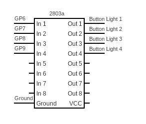
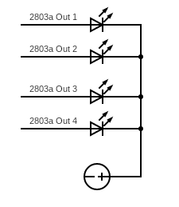
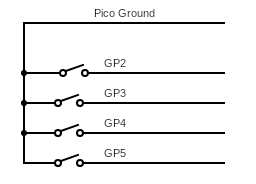

# Raspberry Pi Sprinkler Remote

### What? 
A remote controller used by industry professionals to control sprinkler systems when performing on-site inspections or repairs. There are two separate devices to use. First, the main control box is connected to the existing sprinkler remote box or valve wires. Next, the remote controller is powered and used to send a signal to the main control box. Although not as robust, this is sufficient for most needs. 

### Why?
Many of the existing solutions are expensive, locked to a system and quite buggy. This is an open source project allowing anyone to create their own remote and use it on site. 

## The Project 
---
### **Items**
#### Remote 
1. [Raspberry Pico](https://www.raspberrypi.com/products/raspberry-pi-pico/) or any micro controller with access to serial/uart 
2. [Enclosure](https://www.digikey.com/en/products/detail/bud-industries/CU-389-MB/439256) or similar item
3. [Latching Light Up Buttons](https://www.amazon.com/gp/product/B083QMF2J1) or any buttons 
4. [ULN2803A DARLINGTON TRANSISTOR ARRAY, NPN, 8, 50V, DIP](https://www.newark.com/stmicroelectronics/uln2803a/darlington-transistor-array-npn/dp/89K1143) or similar darlington array(a smaller array will work)
5. [HC-12 433Mhz](https://www.amazon.com/dp/B01MYTE1XR) or similar HC-12 433Mhz module.

### Control Box 
1. [Arduino Mega 2560](https://store-usa.arduino.cc/products/arduino-mega-2560-rev3?selectedStore=us) or any micro controller with access to serial/uart. Even a pico can work here. 
2. [HC-12 433Mhz](https://www.amazon.com/dp/B01MYTE1XR) or similar HC-12 433Mhz module.
3. [Enclosure](https://www.digikey.com/en/products/detail/bud-industries/AN-1307-A/5804544) or similar item
4. Harness/Valve Connectors: [M-Socket](https://www.digikey.com/en/products/detail/phoenix-contact/1771282/3605936) and [F-Header](https://www.digikey.com/en/products/detail/phoenix-contact/1789203/5189404)
5. Power Connectors: [M-Socket](https://www.digikey.com/en/products/detail/phoenix-contact/1714977/2527925) and [F-Header](https://www.digikey.com/en/products/detail/phoenix-contact/1727566/3596865)
6. [Power cord](https://www.amazon.com/dp/B07KQH5GXL?psc=1&ref=ppx_yo2ov_dt_b_product_details) or similar 24v AC power adapter. The same cord from sprinkler controllers can be used here
7. [4 Channel Relay Board](https://www.amazon.com/dp/B0057OC5O8?psc=1&ref=ppx_yo2ov_dt_b_product_details) or similar. A larger relay board may be used to control more stations
8. [Banana Plug](https://www.newark.com/tenma/76-1646/banana-plug-4mm-36a-screw-red/dp/01AC7888) used for the alligator clips.
9. [Alligator Clips](https://www.newark.com/mueller-electric/bu-126-2/alligator-clip-8-9mm-10a-red/dp/56AC1981) or similar. 

### Misc Items:
1. [Wago 221 Lever Connectors](https://www.wago.com/us/discover-wire-and-splicing-connectors/221) used to make easier connections 
2. [Ferrule Connectors](https://www.newark.com/knipex/97-99-905/connector-kit-terminal-splice/dp/57AC5016) used for stranded wires
3. [22AWG Solid Copper Wires](https://www.amazon.com/dp/B08DY3QB7T?psc=1&ref=ppx_yo2ov_dt_b_product_details) used for inner connections 
4. [18AWG Silicone Wires](https://www.amazon.com/BNTECHGO-Flexible-Silicone-Resistant-Electronic/dp/B06Y5JSZR3) used for the alligator clips. Solid wire can be used but silicone wire is more flexible 

### **The Setup**

### Remote 
---
For the buttons used, there are 12v LED lights that can be attached to the darlington transistor array since the picos GPIO doesn't provide enough power. 

The circuit is shown below. Connect the Picos GPIO Pin 6 to In 1 of the transistor array, GPIO Pin 7 to In 2, GPIO Pin 8 to In 3, GPIO Pin 9 to In 4 and ground to ground. From the out, set the Out 1 to the first buttons ground, Out 2 to second buttons ground, Out 3 to the third buttons ground and out 4 to the fourth buttons ground. 
|  | 
|:--:| 
| *Optional lighting setup with darlington array.* |

|  | 
|:--:| 
| *Optional lighting setup with darlington array.* |

|  | 
|:--:| 
| *Latching Buttons Setup* |

