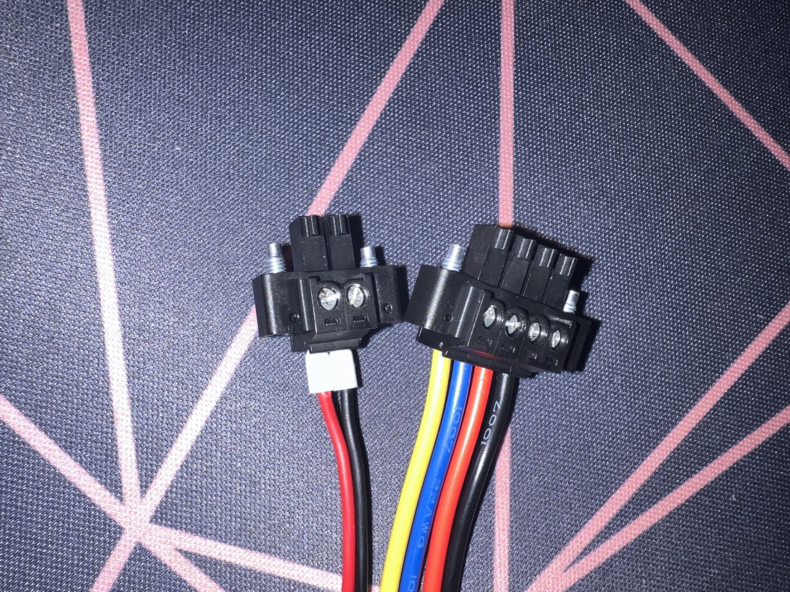

# Raspberry Pi Sprinkler Remote
| |  |
|:--:| :--:|
| *Remote* | *Controller*|

### What? 
A remote controller used by industry professionals to control sprinkler systems when performing on-site inspections or repairs. There are two separate devices to use. First, the main control box is connected to the existing sprinkler remote box or valve wires. Next, the remote controller is powered and used to send a signal to the main control box. Although not as robust, this is sufficient for most needs. 

### Why?
Many of the existing solutions are expensive, locked to a system and quite buggy. This is an open source project allowing anyone to create their own remote and use it on site. 


## The Project 
---
### **Items**

#### Remote 


1. <a href="https://www.raspberrypi.com/products/raspberry-pi-pico/" target="_blank">Raspberry Pico!</a> or any micro controller with access to serial/UART
2. <a href="https://www.digikey.com/en/products/detail/bud-industries/CU-389-MB/439256" target="_blank">Enclosure</a> or similar item
3. <a href="https://www.amazon.com/gp/product/B083QMF2J1" target="_blank">Latching Light Up Buttons</a>  or any buttons 
4. <a href="https://www.newark.com/stmicroelectronics/uln2803a/darlington-transistor-array-npn/dp/89K1143" target="_blank">ULN2803A DARLINGTON TRANSISTOR ARRAY, NPN, 8, 50V, DIP</a>  or similar Darlington array(a smaller array will work)
5. <a href="https://www.amazon.com/dp/B01MYTE1XR" target="_blank">HC-12 433Mhz</a> or similar HC-12 433Mhz module.

### Control Box 
1. <a href="https://store-usa.arduino.cc/products/arduino-mega-2560-rev3?selectedStore=us" target="_blank">Arduino Mega 2560</a> or any micro controller with access to serial/UART. Even a Pico can work here. 
2. <a href="https://www.amazon.com/dp/B01MYTE1XR" target="_blank"> HC-12 433Mhz</a> or similar HC-12 433Mhz module.
3. <a href="https://www.digikey.com/en/products/detail/bud-industries/AN-1307-A/5804544" target="_blank"> Enclosure</a>  or similar item
4. Harness/Valve Connectors: <a href="https://www.digikey.com/en/products/detail/phoenix-contact/1771282/3605936" target="_blank"> M-Socket</a> and <a href="https://www.digikey.com/en/products/detail/phoenix-contact/1789203/5189404" target="_blank"> F-Header</a> 
5. Power Connectors: <a href="https://www.digikey.com/en/products/detail/phoenix-contact/1714977/2527925" target="_blank"> M-Socket</a> and <a href="https://www.digikey.com/en/products/detail/phoenix-contact/1727566/3596865" target="_blank"> F-Header</a> 
6. <a href="https://www.amazon.com/dp/B07KQH5GXL?psc=1&ref=ppx_yo2ov_dt_b_product_details" target="_blank"> Power Cord</a> or similar 24v AC power adapter. The same cord from sprinkler controllers can be used here
7. <a href="https://www.amazon.com/dp/B0057OC5O8" target="_blank"> 4 Channel Relay Board</a>  or similar. A larger relay board may be used to control more stations
8.  <a href="https://www.newark.com/tenma/76-1646/banana-plug-4mm-36a-screw-red/dp/01AC7888" target="_blank"> Banana Plug</a> or similar, used for the alligator clips.
9.  <a href="https://www.newark.com/mueller-electric/bu-126-2/alligator-clip-8-9mm-10a-red/dp/56AC1981" target="_blank">Alligator Clips</a> or similar, used in conjunction with the banana plugs. 

### Misc Items:
1. <a href="https://www.wago.com/us/discover-wire-and-splicing-connectors/221" target="_blank">Wago 221 Lever Connectors</a> used to make easier connections 
2. <a href="https://www.newark.com/knipex/97-99-905/connector-kit-terminal-splice/dp/57AC5016" target="_blank">Ferrule Connectors</a> used for stranded wires
3. <a href="https://www.amazon.com/dp/B08DY3QB7T?psc=1&ref=ppx_yo2ov_dt_b_product_details" target="_blank">22AWG Solid Copper Wires</a>  used for inner connections 
4. <a href="https://www.amazon.com/BNTECHGO-Flexible-Silicone-Resistant-Electronic/dp/B06Y5JSZR3" target="_blank">18AWG Silicone Wires</a> used for the alligator clips. Solid wire can be used but silicone wire is more flexible 

## **The Setup**
---

## Remote 

### <ins>2803a Darlington Transistor Array and Button Lights Setup </ins>
For the buttons used, there are 12v LED lights that can be attached to the Darlington transistor array since the Pico's GPIO doesn't provide enough power. 

The circuit is shown below. Connect the Pico's GPIO Pin 6 to In 1 of the transistor array, GPIO Pin 7 to In 2, GPIO Pin 8 to In 3, GPIO Pin 9 to In 4 and ground to ground. From the out, set the Out 1 to the first buttons ground, Out 2 to second buttons ground, Out 3 to the third buttons ground and out 4 to the fourth buttons ground. 
|  | 
|:--:| 
| *Optional lighting setup with Darlington array.* |

As seen below, on the buttons LED lights, connect the Out 1 from the Darlington array to the ground cable of button LED one, Out 2 to the second buttons LED ground cable, Out 3 to the third buttons LED ground cable and Out 4 to the fourth buttons LED ground. Now, connect all LED power cables to a 5-12v DC source. In this project, all power cables were connected with a w Wago 5 terminal block connected to a stripped USB cable providing 5v power. 

|  | 
|:--:| 
| *Optional lighting setup with Darlington array.* |

### <ins>Button Setup</ins> 
As seen below, connect the buttons ground together to the ground on the Pico(once again, in lieu of a PCB, protoboard or breadboard, a Wago 221 5 terminal connector was used here). Next connect the first buttons positive terminal to the Pico's GPIO 2, the second button to GPIO 3, the third button to GPIO 4 and the fourth button to GPIO 5. You can substitute the GPIO for any others but make sure to keep track of the number.
|  | 
|:--:| 
| *Latching Buttons Setup* |

### <ins>HC-12 Setup</ins>

The HC-12 listed above needs headers or pins to be soldered onto the board. After that, you can connect the TX from the HC-12 to the RX on the Pico and the RX on the HC-12 to the TX on the Pico. Next connect the ground and VCC to a power source, 5v is preferred but it does work with the Pico's 3v. The Set pin should be left unconnected unless you're performing AT commands to change the settings in which case you should connect it to a ground in the Pico. Lastly, connect the provided antenna to the header on the HC-12 module or connect an IPEX-to-BNC antenna on the provided connector. 
|  | 
|:--:| 
| *HC-12 Remote Side Setup* |

### <ins>Pico GPIO Setup</ins> 
The setup for the Pico is shown below. You can use any GPIo and ground buttons for the connections labeled GP or GND but the HC-12 must be connected to the UART0 and the provided 3v output. For slightly better results, you can connect the HC-12's VCC pin to a 5v source. This is especially crucial if you're using a higher baud transfer rate. This setup is specific to the code but feel free to use any other SBC that fits your setup. 

|  | 
|:--:| 
| *Pico Setup and GPIOs* |


## Controller 

### <ins> Relay Board PCB Setup</ins>
The Relay Boards' PCB can be seen below. You will need to connect the ground to any ground pin on the Arduino Mega and the VCC to a 5v pin on the Mega. Lastly, the In 1 is connected to the Out 1 on the 2803a Darlington Transistor Array, the In 2 to the Out 2, In 3 to Out 3 and In 4 to Out 4. 

|  | 
|:--:| 
| *Relay Board PCB and Controller Setup* |


### <ins> 2803a Darlington Transistor Array to Relay PCB and Arduino Mega Pins </ins>
The Darlington Transistor array is option but due to the functionality of the relay board used, its required to use. Take a look at the following [Amazon review](https://www.amazon.com/gp/customer-reviews/R1PQFVAKUAUD4E/ref=cm_cr_dp_d_rvw_ttl?ie=UTF8&ASIN=B0057OC5O8) providing more details about the way it supposed to work. Now the setup, as seen below, connect the 2803a Darlington transistor arrays In 1 to the Arduino Mega's Digital 22, In 2 to the Digital 23, In 3 to Digital 24 and In 4 to Digital 25. Next, make sure the ground is connected to a ground on the Mega. Next, connect the Out on the 2803a to the headers on the Relay PCB labeled IN as such: First connect the Out 1 to the PCB In 1, Out 2 to the PCB 2, Out 3 to the PCB 4 and Out 4 to the Relay PCB 4. 
|  | 
|:--:| 
| *2803a Transistor Array Setup for Relay* |

### <ins> Relay, Alligator Clips and Socket Connectors Setup </ins>

The Relay is wired like below. The idea is similar to a [sprinkler controller](https://github.com/nebhead/irrigator#schematics) without the complexities of setting up a timer/program. Similar to the schematics linked above, the first relay is used a gate to prevent unwanted behavior during power up.
As such, connect the power wire to Relay 1's NO terminal and connect the output of the first relay to the NO terminal on Relays 2,3, and 4. In order to do that, a Wago 221 5 terminal connector was used in this project similar to the Pico's grounding wiring. Next have a wire going from the Relay 2,3 and 4's output to a respective Alligator clip that can be attached to sprinkler wires. Lastly, connect another Alligator clip from the ground cable of the power source.

 In order to create an easy to use system, the power brick was attached to a male header that is connected to a female socket header on a opening of the device. From there, a power cable is attached from the female socket header and sent to the NO of the relay board. Next, the output of Relays 2-4 is send to a 4 pin female socket header along with the ground cable from the power female socket header. This creates a female socket connector on the outside of the controller that can be plugged into a male socket connector that is then attached to Banana Connectors and Alligator clips. See pictures of this setup below.
|  | 
|:--:| 
| *Relay Wiring* |


### <ins>HC-12 Setup</ins>


If you're using the same HC-12 as listed above, make sure to solder headers or pins to the board. In this implementation, the HC-12 uses a software serial connection created in order to log the received data so the connections are a bit different than what you might expect. The TX on the HC-12 to the Digital pin 10 on the Arduino Mega, the RX on to Digital 11. Next connect ground to ground, and VCC to a 5v on the Mega. Similar to the HC-12 on the remote side, leave the Set pin disconnected unless you're performing AT commands. Lastly, connect the provided antenna to the header on the HC-12 module or connect an IPEX-to-BNC antenna on the provided connector. 
|  | 
|:--:| 
| *HC-12 Controller Side Setup* |


### <ins> Arduino Mega 2560 Header Setup
The Arduino Mega 2560 setup can be seen here. Ground is connected to the Darlington 2803a ground, Relay board PCB ground, and HC-12 ground. In order to simplify connections, a Wago 221 5 terminal connector was used here. Similarly, a Wago 221 3 terminal connector was used to connect the HC-12 VCC and Relay Board PCB VCC to a 5v header on the Mega 2560. Next, the HC-12 Rx is connected to the D11 while the HC-12s TX is connected to the D11 header on the Mega 2560. You can use the RX and TX on the board but will loose logging capabilities to the serial communications when connected to a computer. Lastly, the 2803a Darling Transistor array is connected with D22 to In 1, D23 to In 2,D24 to In 3 and D25 to In 4 on the 2803a. A similar SMC can be used like a Raspberry Pi 3/4 board just make sure it has serial communication capabilities. 

|  | 
|:--:| 
| *Arduino Mega 2560 GPIO Setup* |


## **Code**
---

## [Controller Setup](https://github.com/FrancDuarteMar/Dig333-Sprinkler/blob/main/control-board.ino])

In order to setup the Software serial to allow logging, you need the Software Serial library available in the Arduino IDE. Next, setup a SoftwareSerial called HC12 with Pin 10 as the TX pin and Pin 11 as the RX pin. Use whatever pin in the arguments but make sure TX is first and RX is second like:  ```HC12(TX Pin,RX Pin)```
```
#include <SoftwareSerial.h>

SoftwareSerial HC12(10, 11);  // HC-12 TX Pin, HC-12 RX Pin
```

Next, setup the various pin connectors for the Relay board activation. You can change the pin numbers to whatever you're using. These are the pins going from the Arduino to the 2803a Darlington Transistor Array In connections 
```
int mainPower = 22;
int power1 = 23;
int power2 = 24;
int power3 = 25;
```
Next, the setup function contains the pin numbers used above. There should be no changes needed unless you change the baud rate with AT commands on the HC-12 modules. The default is 9600 as seen in the code below. You can modify it to your corresponding serial baud rate by changing the code as follows: ```HC12.begin(*baud_rate*)```. The rest of the code should stay the same unless you make changes. It is meant to work with whatever values you set above for the mainPower and power1,2, and 3 variables. 
```
void setup() {
  Serial.begin(9600);  // Serial port to computer
  HC12.begin(9600);    // Serial port to HC12
  pinMode(mainPower, OUTPUT);
  digitalWrite(mainPower, LOW);
  pinMode(power1, OUTPUT);
  digitalWrite(power1, LOW);
  pinMode(power2, OUTPUT);
  digitalWrite(power2, LOW);
  pinMode(power3, OUTPUT);
  digitalWrite(power3, LOW);
}
```

The last part of the code is simply a toggle on/off for each valve as data is received that dictates which valve to toggle on and off. This can be improved to make sure on/off corresponds to the on/off of the button but I wanted to keep it as simple as possible so transmission can be as long as possible. A simple idea can be to add a 0/1 to the end of the message but it will only work with valves 0-9. The data received must also be ended with an EOS character as that is what the code looks for but it can be easily changed by substituting ```'\n``` with the desired character in the following line ```String data = HC12.readStringUntil('\n');```. Some last notes about this code, in order to read data being recieved, you must check if ```HC12.available()>0``` because it gives you the data that is available in the HC12 modules. Reading the HC12 module must also be done by calling the HC12 module while printing data to the Serial Communication port must be done by calling the normal ```Serial.println();``` command. You can do most of the same commands for the Software Serial ```HC12``` as you can with the ```Serial``` library.


```
void loop() {
  while (HC12.available() > 0) {
    String data = HC12.readStringUntil('\n');

    if (data == "1") {
      Serial.println("Open 1");
      digitalWrite(mainPower, !digitalRead(mainPower));
      Serial.print("Current Status for pin 22 aka main power: ");
      Serial.println(digitalRead(mainPower));
    }
    if (data == "2") {
      Serial.println("Open 2");
      digitalWrite(power1,!digitalRead(power1));
      Serial.print("Current Status for pin 23 aka Power 1: ");
      Serial.println(digitalRead(power1));
    }
    if (data == "3") {
      Serial.println("Open 3");
      digitalWrite(power2,!digitalRead(power2));
      Serial.print("Current Status for pin 24 aka Power 2: ");
      Serial.println(digitalRead(power2));
    }
    if (data == "4") {
      Serial.println("Open 4");
      digitalWrite(power3,!digitalRead(power3));
      Serial.print("Current Status for pin 25 aka Power 3: ");
      Serial.println(digitalRead(power3));
    }
    Serial.println(data);
    
  }

}
```
The following is the full code for the Arduino Mega 2560. It was loaded onto the board so that it runs on startup. 

```
#include <SoftwareSerial.h>

SoftwareSerial HC12(10, 11);  // HC-12 TX Pin, HC-12 RX Pin

int incByte = 0;
char text[4] = "";
int mainPower = 22;
int power1 = 23;
int power2 = 24;
int power3 = 25;

void setup() {
  Serial.begin(9600);  // Serial port to computer
  HC12.begin(9600);    // Serial port to HC12
  pinMode(mainPower, OUTPUT);
  digitalWrite(mainPower, LOW);
  pinMode(power1, OUTPUT);
  digitalWrite(power1, LOW);
  pinMode(power2, OUTPUT);
  digitalWrite(power2, LOW);
  pinMode(power3, OUTPUT);
  digitalWrite(power3, LOW);
}

void loop() {
  while (HC12.available() > 0) {
    String data = HC12.readStringUntil('\n');

    if (data == "1") {
      Serial.println("Open 1");
      digitalWrite(mainPower, !digitalRead(mainPower));
      Serial.print("Current Status for pin 22 aka main power: ");
      Serial.println(digitalRead(mainPower));
    }
    if (data == "2") {
      Serial.println("Open 2");
      digitalWrite(power1,!digitalRead(power1));
      Serial.print("Current Status for pin 23 aka Power 1: ");
      Serial.println(digitalRead(power1));
    }
    if (data == "3") {
      Serial.println("Open 3");
      digitalWrite(power2,!digitalRead(power2));
      Serial.print("Current Status for pin 24 aka Power 2: ");
      Serial.println(digitalRead(power2));
    }
    if (data == "4") {
      Serial.println("Open 4");
      digitalWrite(power3,!digitalRead(power3));
      Serial.print("Current Status for pin 25 aka Power 3: ");
      Serial.println(digitalRead(power3));
    }
    Serial.println(data);
  }
}
```

## [Remote Code](https://github.com/FrancDuarteMar/Dig333-Sprinkler/blob/main/main.py)
The Raspberry Pico's code is very simple similar to the controller code. 
 If you're using a Raspberry Pi board that uses MicroPython or CircuitPython, this code should work but if you're using the full version of python, you will need to update the GPIO usage and UART with the respective code as well as enabling UART in the raspi-config. First, being by importing the required libraries.
```
from machine import UART
import time
from machine import Pin
```

Next setup UART to the configured baud rate for the HC12 module. The default is 9600 but you can change it as seen in the HC-12 Setup below. 

```
uart = UART(0,9600,timeout=400)
```

Next, the buttons and button lights are setup below to be used later on. The button numbers correspond to the GPIO used so make sure that you have the same or change it to what you're using. The button lights GPIO numbers are what is connected to the 2803a Darlington transistor array In connections. Make sure they're the same as yours or you have updated the values to match your own.

```
button1 = Pin(2, Pin.IN,Pin.PULL_UP)
button2 = Pin(3, Pin.IN,Pin.PULL_UP)
button3 = Pin(4, Pin.IN,Pin.PULL_UP)
button4 = Pin(5, Pin.IN,Pin.PULL_UP)

buttonLight1 = Pin(6,Pin.OUT)
buttonLight2 = Pin(7,Pin.OUT)
buttonLight3 = Pin(8,Pin.OUT)
buttonLight4 = Pin(9,Pin.OUT)
```

Next, in order to make the system a toggle, it needs to keep track of the previous state of the button as seen below. There should be no changes necessary. 

```
prevState1 = button1.value()
prevState2 = button2.value()
prevState3 = button3.value()
prevState4 = button4.value()
```

The following is the body of the code that is used. You can keep the code the same if you didn't make changes to the controller but if you updated the code to a more robust implementation, you need to change the ```uart.write()``` line. Lastly, the ```time.sleep()``` line also affects the response time of the buttons. With a low sleep time of .05, even touching the button toggled the valve on and off. This may be due to the style of the buttons but I suspect that is has to do with how fast the code updates. If you know you wont be changing status quickly, you can up the time to a second or two. 

```
while True:

    but1State = button1.value()
    but2State = button2.value()
    but3State = button3.value()
    but4State = button4.value()

    if but1State != prevState1:
        print("Button 1 Pressed!")
        prevState1 = but1State
        uart.write(str("1")+"\n")
        buttonLight1.value(not but1State)
        
    if but2State != prevState2:
        print("Button 2 Pressed!")
        prevState2 = but2State
        uart.write(str("2")+"\n")
        buttonLight2.value(not but2State)

    if but3State != prevState3:
        print("Button 3 Pressed!")
        prevState3 = but3State
        uart.write(str("3")+"\n")
        buttonLight3.value(not but3State)

    if but4State != prevState4:
        print("Button 4 Pressed!")
        prevState4 = but4State
        uart.write(str("4")+"\n")
        buttonLight4.value(not but4State)
    
    time.sleep(0.25)
```

Finally, the full code for the Pico is the following. The code was loaded onto the Pico's memory and saved as ```main.py``` so that it runs on start up.  
```
from machine import UART
import time
from machine import Pin

uart = UART(0,9600,timeout=400)

button1 = Pin(2, Pin.IN,Pin.PULL_UP)
button2 = Pin(3, Pin.IN,Pin.PULL_UP)
button3 = Pin(4, Pin.IN,Pin.PULL_UP)
button4 = Pin(5, Pin.IN,Pin.PULL_UP)

buttonLight1 = Pin(6,Pin.OUT)
buttonLight2 = Pin(7,Pin.OUT)
buttonLight3 = Pin(8,Pin.OUT)
buttonLight4 = Pin(9,Pin.OUT)

prevState1 = button1.value()
prevState2 = button2.value()
prevState3 = button3.value()
prevState4 = button4.value()

while True:

    but1State = button1.value()
    but2State = button2.value()
    but3State = button3.value()
    but4State = button4.value()

    if but1State != prevState1:
        print("Button 1 Pressed!")
        prevState1 = but1State
        uart.write(str("1")+"\n")
        buttonLight1.value(not but1State)
        
    if but2State != prevState2:
        print("Button 2 Pressed!")
        prevState2 = but2State
        uart.write(str("2")+"\n")
        buttonLight2.value(not but2State)

    if but3State != prevState3:
        print("Button 3 Pressed!")
        prevState3 = but3State
        uart.write(str("3")+"\n")
        buttonLight3.value(not but3State)

    if but4State != prevState4:
        print("Button 4 Pressed!")
        prevState4 = but4State
        uart.write(str("4")+"\n")
        buttonLight4.value(not but4State)

    time.sleep(0.25)
```
## HC-12 Setup

Although I did not change anything because I haven't been able to test the current design in a real world environment, here are some valuable commands on the setup for the HC-12. In order to perform AT commands for the HC-12, make sure the Set pin on the HC-12 module is connected to a ground pin on a board. The best way to do this is by setting up the Arduino Mega 2560 controller code first and then using the Arduino IDE serial communication window to send commands. To look at all the commands available, make sure to look at the [HC-12's Manual](/images/HC-12.pdf)

| Command | Response | Description |
|:---|:---:|:---|
|```AT```| "Ok" | Test command to make sure the  HC-12 module is in programming mode. |
|```AT+B1200```| "OK+B1200" | Changes the baud rate. The slower the  baud rate, the longer the module can  transmit.  |
|```AT+C020```| "COK+C020" | Changes the channel that is used to transmit.  This is crucial if multiple modules  are in close proximity.  |
|```AT+FU3```| "AT+OK" | Changes the transmission settings to a preset  group. This should not be required unless  you need transmission to be very long with only short messages being set every 1 or 2 seconds at least. |

## The Design
| | 
|:--:| 
| *Stranded Wires* <br> Stranded wires I added ferrules to |

| | 
|:--:| 
| *Ferrule Crimping* <br> Ferrules were crimped with a Knipex ferrule crimper. A smaller wire stripper crimper tool probably wouldn't have worked for this  |

| | 
|:--:| 
| *Finished Ferrule Connector* <br> A finished ferrule connector. I added ferrule connectors to all the stranded wires so they could be connected to breadboards or terminal connectors. Stranded wires are okay to be used on Wago 221 connectors without a ferrule so they did not have one if they were used like that.  |


| | 
|:--:| 
| *Banana Plugs Wiring* <br> They are needed to be connected to the alligator clips. These are screw-in allowing for easy repair and you can use them with any Alligator clips |

| | 
|:--:| 
| *Finished Banana Plug* <br> The banana plug will look like the following. It just needs to be plugged into the alligator clips. These are 2mm sockets |


| | 
|:--:| 
| *Controller socket holes outline* <br> Holes that needed to be made. In the end, I used a drill and a rotary tool to make the holes but something like an oscillating tool would've given better results. |

| | 
|:--:| 
| *Socket Headers* <br> Socket headers were glued with silicone to the outside of the holes made. The common/ground wire was connected between the power and alligator clip harness. The socket headers were put into protoboards and then the wires were connected to the relay boards |

| | 
|:--:| 
| *Relay Board Power Wiring* <br> The output of relay 1 is connected to NO of the other relays. They are connected using a Wago 221 5 terminal connector |

| | 
|:--:| 
| *Relay Board Wiring* <br> The power is shared as described in the circuit section. The color wires are connected to the sockets on the protoboard |

| | 
|:--:| 
| *Relay Board PCB Connections* |

| | 
|:--:| 
| *2803a Wiring* <br> The Darlington array wired on a mini breadboard with ground shared between all devices and 5v power being shared on the breadboard |

| | 
|:--:| 
| *Controller Complete Wiring* <br> The complete wiring for the Arduino and relay board. There was still quite a bit of space inside of this housing so its possible to make it more compact or add additional stations using a larger relay board |

| | 
|:--:| 
| *Remote Buttons* <br> Button holes made on the housing. A few scuffs on the outside but the performance is still great. The hole for the second button was a bit large but it still worked |

| | 
|:--:| 
| *Remote Buttons Backside* <br> The backside of the buttons on the remote. The blue wires are for the button functions while the black and red are the LED wirings. |


| | 
|:--:| 
| *Remote 2803a Wiring* <br> Wiring for the 2803a and button LEDs. The button LEDs had stranded wires so I added ferrule connectors to plug them into the tiny breadboard |

| | 
|:--:| 
|  *Remote Complete Wiring* <br> All of the wiring for the Pico. The HC12 is glued at the top with the antenna probing outside of the box. The grounds and power are all connected  in Wago terminals connectors. The 2803a is set on a tiny breadboard. The fit was very tight but everything fit together|

## Finished Product

|  | 
|:--:| 
| *Alligator Clips Finished Design* <br> The common/ground alligator clip should've been a black clip but I only had red ones. |

| | 
|:--:| 
| *Finished Connectors* <br> The finished male socket connectors using Phoenix Contact Term Block Plugs 2POS and 4POS Str 3.5MM. |

| | 
|:--:| 
| *Controller Top View* |

|| 
|:--:| 
| *Controller Outside View* <br> Outside view of the controller box. The connectors are on the side of the metal box. |

| | 
|:--:| 
| *Connectors <br>* Connector on the outside with the power and alligator clip harness connected |


| | 
|:--:| 
| *Remote Outside View* <br> The outside view of the remote housing. The buttons are on when push in and off when pushed out. There are labels on each button to give the user more information. |


## Further Goals
1. The current toggle button is not very robust so improving that system by sending more useful commands from remote to controller will greatly improve user experience
   
2. The current system worked through a few walls including an exterior brick and interior cinder-block-like dorm walls so the range seems adequate but further testing is needed. I can improve the range using a better antenna than what is included. Additionally, changing the settings of the HC-12 modules can easily reach 100m and even 1km with enough tuning. This will need to work with the toggle improvements so 1km might not be possible but 500km shouldn't be too difficult.
    

   
4. Currently, this works for 3 stations but I would like for it to work with at least 8 or 16, some of the more common sprinkler station numbers. It would be nice to have a modular system as well that would be used depending on the number of stations needed instead of a large product. 
3. Find a better power source for the SMC because they currently require external power. I would like to add voltage converters that allow everything to run off of one power source. Additionally, the remote controller needs to be smaller and water proof to be more effective.
## Inspiration

The summer before college, I was helping my uncle use an Irritrol Pro Max remote controller but we encountered many issues. Jokingly, my uncle told me to make him a better one and I wasn't really sure I could but I told him I would try because the way the remote worked didn't seem too complicated. I wasn't able to make anything that summer but when looking for possible projects, I found a project using a Solenoid so I remembered the project that my uncle suggested nearly 4 years ago. I then began searching for an open source alternative but wasn't able to find anything so I decided to learn more about how sprinklers work in order to make my own. The context book from the semester really emphasized learning the basics and finding out how things worked in order to hack them or simply become a better user. As a result, I explored various Raspberry Pi sprinkler ideas so I could learn the best approach to creating my own remote controlled sprinkler controller. Although I haven't tested this on an actual sprinkler system, the makeshift system that I created worked so I can call this project a great success so far! 

## Resources

1. Working with radio transmitters 
   1. https://www.hackster.io/news/how-to-chat-between-two-raspberry-pis-over-433mhz-radio-9cdaaa1fbd00
   2. https://magpi.raspberrypi.com/articles/build-433mhz-radio-chat-device
   3. https://github.com/mrpjevans/rfchat
   4. https://circuitdigest.com/microcontroller-projects/wireless-rf-communication-between-arduino-and-raspberry-pi-using-nrf24l01
   5. https://forums.raspberrypi.com/viewtopic.php?t=308804
   6. https://www.youtube.com/watch?v=vxF1N9asjts
   7. https://www.youtube.com/watch?v=0zOTvB0T5fY
   8. https://www.youtube.com/watch?v=awOPJK5He28
2. Understanding how sprinklers work
   1. https://rayshobby.net/wordpress/understanding-24vac-sprinkler-valves/
   2. https://www.hackster.io/Ryan33/raspberry-pi-web-page-based-sprinkler-controller-00d26f
   3. https://www.instructables.com/Raspberry-Pi-Controlled-Irrigation-System/
   4. https://github.com/nebhead/irrigator
   5. https://www.youtube.com/watch?v=3CDXZoabCto
   6. https://selfhostedhome.com/diy-wifi-sprinkler-controller-using-esp8266-part-1/
   7. https://forums.raspberrypi.com/viewtopic.php?t=84337